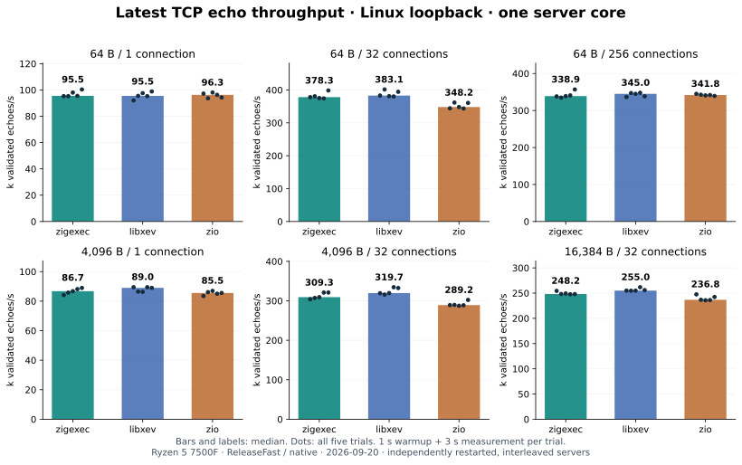
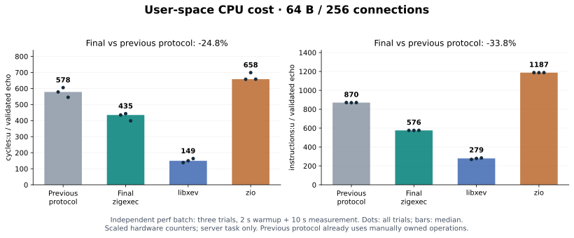

# zigexec

**English** | [简体中文](README.zh-CN.md)

A sender/receiver execution library for **Zig 0.17 master**, inspired by
[P2300](https://wg21.link/P2300R10) and
[NVIDIA stdexec](https://github.com/NVIDIA/stdexec). It provides lazy
composition, asynchronous sequencing, concurrent joins, thread pools,
callback-based cancellation, shared senders, and real **io_uring file,
socket, and timer I/O**.

The protocol, public API, and backends do not depend on `std.Io`, libc, or
third-party libraries. Linux futex and io_uring backends are currently
available. The tested compiler version is
`0.17.0-dev.2127+e90365cd5`; later breaking changes on Zig master may require
updates, and Zig 0.16 is not supported.

Detailed design notes are available in both English and Chinese under [`docs/`](docs/).

## Build and test

```sh
zig build                  # Build the CPU, file I/O, and TCP echo examples
zig build test             # Core, cancellation, shared-state, and generic I/O tests
zig build test-io           # Real kernel integration tests; io_uring must be permitted
zig build test-errors       # Expected compile failures and diagnostic checks
zig build test-all          # Run tests and compile-time diagnostic checks
zig build test-all -Doptimize=ReleaseSafe
zig build run              # 3² + 4² + 5² = 50
zig build run-io            # read 14 bytes: hello io_uring
zig build run-echo -- 9000  # TCP echo server on 127.0.0.1:9000
zig build test-echo         # Local TCP verification; requires Python 3
```

Integration tests use the real kernel. They do not substitute mocks or
silently skip tests when io_uring is unavailable. Tests live in `tests/` and
are not compiled into the library module.

## Benchmarks

See [`benchmarks/`](benchmarks/README.md) for reproducible Linux TCP echo comparisons
with libxev and zio, including pinned dependencies, native load generation,
throughput, RTT, CPU usage, and raw measurements. These results describe the tested
TCP workloads, not a general ranking of asynchronous libraries.

The [final performance report (Chinese)](benchmarks/PERFORMANCE.zh-CN.md) consolidates
the optimized implementation's six-scenario comparison, perf counters, and memory layout.





Bars show medians and dots show every trial. On the tested Ryzen 5 7500F Linux
loopback setup, zigexec is within -1.9% to +2.0% of libxev throughput across the
six workloads and leads zio in five of six. The completion-protocol revision
reduces zigexec user-space cycles per echo by 24.8% and instructions by 33.8%.
These measurements apply only to the documented single-server-core TCP setup;
see the final report for methodology, latency, ranges, and limitations.

## Composable pipelines

```zig
const std = @import("std");
const ex = @import("zigexec");

const Double = struct {
    pub fn call(_: @This(), value: i64) i64 { return value * 2; }
};

pub fn main() !void {
    const allocator = std.heap.page_allocator;
    const pool = try ex.ThreadPool.init(allocator, 2);
    defer pool.deinit();

    const work = ex.just(.{21}).then(Double, .{}).startsOn(pool.getScheduler());
    const values = (try work.syncWait(.{ .allocator = allocator })) orelse return;
    std.debug.print("{d}\n", .{values[0]}); // 42
}
```

`just(42)` represents one value, `just(.{})` represents empty successful
completion, and `just(.{ a, b })` represents two values. Untyped integer and
floating-point literals become `i64` and `f64`; use `@as` for another type.

The core model uses composable pipelines, explicit state, and compile-time
callback types:

```zig
const task = source.letValue(
    ex.upstream()
        .letValue(SendRequest, .{ config, client })
        .then(Decode, .{})
        .then(AddOffset, .{offset}),
    .{},
);
```

`SendRequest`, `Decode`, and `AddOffset` are struct types with a `pub fn call`;
their arguments initialize captured fields. Construction and `connect` do not
execute application callbacks. The graph, callbacks, and types are determined
at compile time while configuration and other captured state remain runtime
values. `upstream()` binds the nearest `letValue` input and passes it by value.

Reflection checks produce diagnostics containing the node, callback, argument
index, and types. For example, passing an integer to a callback that expects a
string reports:

```text
zigexec.then: wrong_input.Length.call upstream argument 0: expected []const u8, got i64
```

See the Chinese design note on
[expressions and lifetimes](docs/expressions.md) for the full semantics.

## Type constructors and inference

Local variables use ordinary inference. Public type constructors are available
for function return types and struct fields:

```zig
fn number(value: i64) ex.Just(.{i64}) {
    return ex.just(.{value});
}

const Work = ex.Just(.{i64})
    .Then(Double)
    .StartsOn(ex.ThreadPool.Scheduler);

const Io = ex.io.For(*ex.IoUring);
```

Type-level `.Then`, `.LetValue`, `.StartsOn`, and related methods correspond to
their value-level forms and produce the same concrete sender types. Generic
callbacks are specialized from upstream argument types. `Fn` preserves the
identity of an ordinary function at compile time:

```zig
fn twice(value: anytype) @TypeOf(value) { return value * 2; }
const work = ex.just(.{@as(u16, 21)}).then(ex.Fn(twice), .{});
```

`meta.ReturnOf`, `meta.ValuesOf`, `meta.ValueOf`, `meta.OperationOf`, and
`meta.WaitResult` expose associated types without running or type-erasing a
sender. Zig still requires declared return types at function boundaries.

## API overview

| Purpose | API |
| --- | --- |
| Immediate senders | `just`, `justError(Values, err)`, `justStopped(Values)`, `readEnv`, `readAllocator` |
| Value transforms | `.then(Callback, args)` |
| Synchronous recovery | `.uponError(Callback, args)`, `.uponStopped(Callback, args)` |
| Asynchronous factories/recovery | `.letValue(Factory, args)`, `.letError(Factory, args)`, `.letStopped(Factory, args)` |
| Sub-pipelines/sequencing | `.letValue(body, .{})`, `.letValue(child, .{})` |
| Repetition | `.repeat()`, `.repeatUntil()` |
| Concurrent results | `whenAll(.{a, b, ...})` → concatenated arguments, `whenAny(.{ .a = a, .b = b })` → union |
| Scope association | `.associate(token)` → owner with `.sender()`, `.takeSender()`, `.deinit()` |
| Indexed execution | `.bulk(count, Callback, args)` |
| Execution contexts | `ThreadPool`, `RunLoop`, `InlineScheduler`, `TrampolineScheduler`, `IoUring` |
| Scheduling | `scheduler.schedule()`, `.startsOn(scheduler)`, `.continuesOn(scheduler)` |
| Cancellation | `StopSource`, `StopToken`, `StopCallback`, `.withStopToken(token)` |
| Shared computation | `.split(allocator)`, then owner `.sender()`, `.clone()`, `.deinit()`, `.requestStop()` |
| Consumption | `.syncWait(env)`, `syncWait(sender, env)`, `connect` / `start` |

`syncWait` returns `anyerror!?Sender.Values`: success is a tuple, errors use
`try`/`catch`, and stopped is `null`. An empty tuple is distinct from stopped.
`whenAll` waits for every branch; on failure it requests cancellation of its
siblings and waits for cleanup. Errors take precedence over stopped, and the
first observed error is reported. Success passes concatenated arguments downstream; `syncWait` returns them as a tuple.
`whenAny` selects the first completion, cancels peers, and waits for every branch
to retire; success passes a tagged union of branch completion tuples. See
[concurrent result shapes](docs/combinators.md).

## Execution environment and cancellation

The allocator is an optional `Env` property. Tasks that do not query it can use
`task.syncWait(.{})`; provide it explicitly for tasks that allocate:

```zig
const result = try task.syncWait(.{ .allocator = allocator });

const result_with_stop = try task.syncWait(.{
    .allocator = allocator,
    .stop_token = source.token(),
});
```

Senders query `receiver.getEnv().getAllocator()` during `start` and handle its
error union. A missing allocator produces `error.MissingAllocator`; `readAllocator()`
forwards it through the error channel. There is no implicit global allocator.
The allocator is borrowed; `syncWait` does not implicitly free owning results.
`IoUring.init`, `ThreadPool.init`, and `split` still require their own allocator.

Cancellation is callback based and thread-safe:

```zig
var source: ex.StopSource = .{};
defer source.deinit();
var registration: ex.StopCallback = .{};
registration.init(source.token(), &state, onStop);
defer registration.deinit();
_ = source.requestStop();
```

Registration against an already-stopped source invokes the callback
synchronously. `deinit` waits for a callback already executing on another
thread and supports a callback unregistering or destroying itself.
Cancellation remains cooperative for CPU work; io_uring requests use the
callback to wake the reactor and submit kernel cancellation.

## Shared senders

```zig
var shared = try ex.just(.{21}).then(Double, .{}).startsOn(cpu).split(allocator);
defer shared.deinit();

const values = (try ex.whenAll(.{
    shared.sender(),
    shared.sender().then(Double, .{}),
}).syncWait(.{ .allocator = allocator })).?; // .{ 42, 84 }
```

`split` allocates shared state but remains lazy until the first subscription.
Later subscribers share or replay the cached value, error, or stopped result.
Owners must use `.clone()` for additional ownership; ordinary Zig assignment
does not increment the reference count. `.sender()` returns a borrowed view.

## io_uring

```zig
const context = try ex.IoUring.init(allocator, .{ .entries = 64 });
defer context.deinit();

const n = (try ex.io.readSome(context, fd, buffer, 0)
    .syncWait(.{ .allocator = allocator })).?[0];
_ = n;
```

The backend supports:

- Files: `openAt`, `readSome`, `writeSome`, `fsync`, and `close`.
- Sockets: `accept`, `connect`, `recv`, `send`, and short-write-safe `sendAll`.
- Timers: `sleepFor(context, nanoseconds)` using a monotonic clock.
- Scheduling: `context.getScheduler().schedule()`.

Each context owns one reactor thread. Continuations after I/O complete on that
thread by default; move CPU-intensive work with `.continuesOn(pool.getScheduler())`.
`shutdown()` rejects new submissions and cancels pending requests; `deinit()`
waits for completion before releasing resources.

## TCP echo example

```sh
zig build run-echo -- 9000
# In another terminal:
nc 127.0.0.1 9000
```

The accept callback allocates, connects, and directly starts each client's
`recv → sendAll → repeat` operation on the reactor. A Client owns its 16 KiB
buffer and Connection; a reactor-owned intrusive list tracks clients. Its
Completion unlinks the node, closes the socket, and frees storage. This
single-reactor example needs no spawn, CountingScope, or per-client stop source.
`--once` waits for the client to retire; accept failure shuts down the context
and drains actual I/O completions. Main waits only for final drain notification.
Callbacks do not block; `MSG_NOSIGNAL` prevents SIGPIPE.

`zig build test-echo` checks 32 simultaneous clients plus an idle client, binary
and fragmented transfers, half-close, reset/reconnect, and `--once` draining.
See [dynamic task scopes](docs/counting_scopes.md) for ownership and cancellation.

`SimpleCountingScope` provides association counting; `CountingScope` adds stop
requests. `join()` keeps admission open while associations remain; `close()` and
`requestStop()` are independent. `spawn(sender, token, env)` requires explicit
allocation and compile-time error handling. Scope join never aggregates child
errors. `runInScope` is the separate producer cleanup policy used by the example.

## Use as a dependency

In the consumer's `build.zig.zon`:

```zig
.zigexec = .{ .path = "../zigexec" },
```

In the consumer's `build.zig`:

```zig
const dep = b.dependency("zigexec", .{ .target = target, .optimize = optimize });
exe.root_module.addImport("zigexec", dep.module("zigexec"));
```

The project is not a complete C++26 implementation. Each sender has one static
success tuple, errors use `anyerror`, and `on` environment restoration,
full P3149 async-scope APIs (including `spawnFuture`), GPU integration, coroutine integration, additional
platform backends, and benchmarks beyond TCP echo are not yet provided.

## Operation lifetimes

Completion values are borrowed from stable operation storage. Internal forwarding
through `letValue`, `upstream`, `continuesOn`, and stop wrappers avoids payload
copies. Callback arguments retain their declared types; owned result boundaries
such as `syncWait` and `split` still copy values when needed.

For custom senders/receivers, `setValue` now takes `*const Values`.
`ex.connectInto(&operation, sender, receiver)` constructs `ex.Connection(S, R)`
in its final storage, with a concrete child operation. Keep connected storage
immovable, including before start. Any completion may destroy the connection;
producers must perform their final operation access before signaling it. Owners
may retain children to keep borrowed results alive. There is no second completion
notification or generic execution reference count. Typed `UnstoppableEnv` removes
unused cancellation storage. See [the lifetime protocol](docs/lifetimes.md).

### Manual connection storage

```zig
var operation: ex.Connection(@TypeOf(sender), @TypeOf(&receiver)) = undefined;
ex.connectInto(&operation, sender, &receiver);
operation.start();
```

`Operation(R)` retains the concrete receiver type. Connection constructs known children at their final addresses; do not copy or move connected storage, and reclaim it during completion or retain it for borrowing. The old two-argument value-returning `connect` is replaced by three-argument in-place construction. Fluent composition, `syncWait`, and `spawn` usage is unchanged. See [lifetimes](docs/lifetimes.md).

## Documentation

The complete bilingual design notes cover:

- [Architecture and stdexec correspondence](docs/design.md)
- [Expressions and lifetimes](docs/expressions.md)
- [Type API](docs/types.md)
- [Concurrent tuple and union results](docs/combinators.md)
- [Counting scopes and associations](docs/counting_scopes.md)
- [Allocator and environment semantics](docs/allocators.md)
- [Cancellation](docs/cancellation.md)
- [Shared state and ownership](docs/shared.md)
- [Repetition](docs/repeat.md)
- [io_uring backend](docs/io_uring.md)
- [Operation result storage and execution scopes](docs/lifetimes.md)

## License

This project is licensed under the [Mozilla Public License 2.0](LICENSE).

See the [stdexec-inspired optimization report](benchmarks/STDEXEC.zh-CN.md) for
trampoline/repeat, batched io_uring, manually owned echo operations, and measurements.
