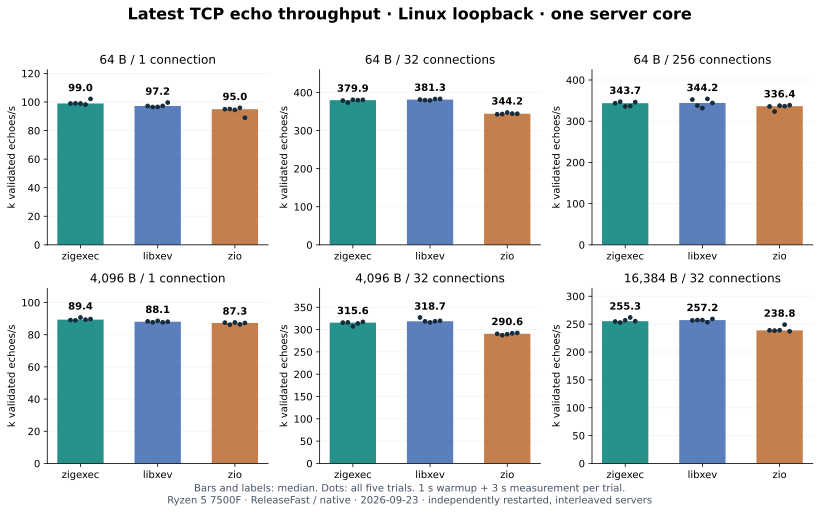
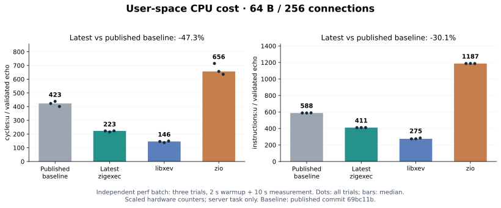

# zigexec 最新性能报告

2026-09-23 · AMD Ryzen 5 7500F · Linux io_uring · 单服务端核 TCP echo

## 结论

本轮测量当前工作区的 zigexec，并将已发布提交 `69bc11b` 作为交错运行的基线。
六个 TCP echo 场景中，zigexec 的吞吐中位数相对基线为 **+1.1%～+3.3%**；
其中五组的五次样本范围仍有重叠，4 KiB / 1 连接一组范围不重叠。
这些短试验显示了本机上的改善迹象，但不足以推断跨机器或其他负载的稳定收益。

相对同批 libxev，zigexec 六组吞吐中位数为 **-1.0%～+1.8%**；相对 zio
为 **+2.2%～+10.4%**。延迟并非每组都领先。本报告比较固定版本和配置的完整
TCP echo 应用，不代表异步库的综合排名。

独立 perf 批次的 64 B / 256 连接场景中，zigexec 相对基线的用户态
cycles/echo 从 423.06 降至 222.75（**-47.3%**），instructions/echo 从
587.87 降至 410.67（**-30.1%**）。这批代码同时改变 io_uring ring 配置、
请求跟踪、operation 布局及调度路径；没有逐项消融实验，不能把降幅归于某一处。

被测 zigexec 二进制 SHA-256 为
`5e090a966b706858f76a96c439f9f3f69c396e458070ec801f783bbeafa324a3`。
原始吞吐和 perf 归档保存了构建清单、源码哈希及本轮工作区内容，能识别实际被测版本。

## 范围与环境

| 项目 | 设置 |
|---|---|
| CPU / 系统 | Ryzen 5 7500F，6 核 12 线程；Linux `7.2.4-arch1-2` |
| CPU 分配 | 服务端 CPU 1；客户端 CPU 2/3/4/5，分属不同物理核 |
| 调频 | `powersave` governor，正常动态调频；普通桌面开发机 |
| Zig 编译器 | zigexec / zio：`0.17.0-dev.2127+e90365cd5`；libxev：`0.16.0` |
| 编译方式 | LLVM、ReleaseFast、`-mcpu=native`；负载器 GCC `-O3 -march=native` |
| 主测试 | 4 个实现 × 6 个场景 × 5 次，共 **120 次**；每次预热 1 秒、测量 3 秒 |
| 顺序与校验 | 每次重启服务端，固定种子随机交错；响应逐字节验证 |
| 工作负载 | Linux loopback TCP；稳定连接；每连接一个在途请求；16 KiB 服务端缓冲区 |

| 实现 | 来源 | SQ / CQ | ring flags 与 I/O 操作 |
|---|---|---|---|
| 最新 zigexec | 本轮提交前工作区 | 64 / 64 | 默认请求 SINGLE_ISSUER、DEFER_TASKRUN、COOP_TASKRUN，若内核拒绝则回退无 flags；recv/send |
| baseline | `69bc11b80db0b8ac4dc63fe748ac35b81a696cc7` | 64 / 64 | 0；recv/send |
| libxev | `9ce8e8e6ff89e583258a7f8e7adeeeaeae8611bf` | 64 / 128 | 0；recv/send |
| zio | `b3475afacc7674f01842a9b1e7499f0976972f22` | 256 / 256 | SINGLE_ISSUER、DEFER_TASKRUN、COOP_TASKRUN；recvmsg/sendmsg |

四者都使用一个实际 I/O reactor / loop / executor。最新 zigexec 的默认 ring
策略已不同于基线；libxev 的 Zig 版本、zio 的 ring 容量及操作也不同。
因此本批结果衡量这些完整配置，不隔离抽象层本身的成本。

## 吞吐：六个场景

单位为逐字节校验通过的完整 echo/s。下表各值为五次试验的中位数；百分比
相对各自对照的中位数计算，不是置信区间。

| 场景 | 基线 | 最新 zigexec | libxev | zio | 相对基线 | 相对 libxev | 相对 zio |
|---|---:|---:|---:|---:|---:|---:|---:|
| 64 B / 1 连接 | 96,373 | 98,963 | 97,215 | 94,963 | +2.7% | +1.8% | +4.2% |
| 64 B / 32 连接 | 375,916 | 379,920 | 381,296 | 344,245 | +1.1% | -0.4% | +10.4% |
| 64 B / 256 连接 | 332,715 | 343,673 | 344,210 | 336,398 | +3.3% | -0.2% | +2.2% |
| 4,096 B / 1 连接 | 87,527 | 89,370 | 88,068 | 87,298 | +2.1% | +1.5% | +2.4% |
| 4,096 B / 32 连接 | 308,139 | 315,615 | 318,666 | 290,583 | +2.4% | -1.0% | +8.6% |
| 16,384 B / 32 连接 | 249,005 | 255,252 | 257,205 | 238,782 | +2.5% | -0.8% | +6.9% |



| 场景 | 基线 min–max | 最新 zigexec min–max |
|---|---:|---:|
| 64 B / 1 连接 | 93,951–98,638 | 98,189–102,174 |
| 64 B / 32 连接 | 371,883–381,798 | 373,376–381,074 |
| 64 B / 256 连接 | 322,123–360,763 | 335,791–347,225 |
| 4,096 B / 1 连接 | 86,323–88,050 | 88,891–90,703 |
| 4,096 B / 32 连接 | 304,604–313,507 | 307,135–317,219 |
| 16,384 B / 32 连接 | 248,208–259,804 | 252,801–261,909 |

64 B / 256 连接的基线样本范围尤其宽，故其中位数差异不宜单独解释为
稳定的高并发提速。图中散点包含全部试验，没有挑选最好的一轮。
[逐场景完整统计表](results/2026-09-23-echo.md)还给出单向 MiB/s、RTT、
CPU 和 RSS。

## 延迟与进程资源

RTT 是客户端观测的完整往返时间；p99 是五次试验各自 p99 的中位数，
由向上取整的 1 µs 直方图桶估计，并非合并五次直方图重算。

| 场景 | 最新 zigexec p99 | libxev p99 | zio p99 |
|---|---:|---:|---:|
| 64 B / 1 连接 | 13 µs | 13 µs | 13 µs |
| 64 B / 32 连接 | 107 µs | 108 µs | 113 µs |
| 64 B / 256 连接 | 843 µs | 881 µs | 837 µs |
| 4,096 B / 1 连接 | 14 µs | 15 µs | 14 µs |
| 4,096 B / 32 连接 | 126 µs | 121 µs | 133 µs |
| 16,384 B / 32 连接 | 154 µs | 146 µs | 158 µs |

64 B / 256 连接时，最新 zigexec 的服务端 CPU 中位数约为单核的
65.7%，CPU 时间 1.90 µs/echo，进程 RSS 1.96 MiB。基线对应为
65.0%、1.95 µs/echo、2.96 MiB。RSS 是进程快照，不等于每个
operation 的大小；CPU 时间也不计入独立内核 worker/softirq 的全部成本。

此测试为 closed-loop，每连接最多一个在途请求；RTT 存在 coordinated
omission，不能当作固定到达率下的生产 SLA。

## perf：用户态执行成本

独立于吞吐批次，对 64 B / 256 连接交错测量三次；每次预热 2 秒，测量
10 秒。以下计数按校验通过的 echo 数归一化，再取三次的中位数。

| 实现 | 用户态 cycles/echo | 用户态 instructions/echo | 内核态 cycles/echo | io_uring_enter/echo |
|---|---:|---:|---:|---:|
| 基线 `69bc11b` | 423.06 | 587.87 | 14240.25 | 0.0313 |
| 最新 zigexec | **222.75** | **410.67** | 14444.85 | 0.0313 |
| libxev | 145.84 | 275.02 | 13727.54 | 0.0469 |
| zio | 656.46 | 1186.97 | 14214.20 | 0.0270 |



最新 zigexec 的用户态 cycles 约为同批 libxev 的 1.53 倍，instructions
约为 1.49 倍。内核态 cycles 远高于用户态，且没有随本轮用户态成本按比例下降；
这解释了为何吞吐变化远小于用户态计数变化。硬件事件发生 multiplex，运行
比例约 83%，perf 已缩放；三次试验不能给出精密的统计显著性结论。

[完整 perf 摘要](results/2026-09-23-perf.md)和
[原始计数、脚本、构建清单](results/2026-09-23-perf.json.gz)可复查每次试验。

## 静态布局与微基准

布局探针针对真实 TCP echo 示例。基线布局采用上轮保存的相同探针输出：

| 对象 | `69bc11b` | 最新工作区 | 变化 |
|---|---:|---:|---:|
| Echo loop operation | 824 B | 456 B | -44.7% |
| 客户端根 Connection | 864 B | 488 B | -43.5% |
| 完整 Client（含 16 KiB buffer） | 17288 B | 16912 B | -2.2% |
| accept Connection | 392 B | 272 B | -30.6% |
| Server | 480 B | 360 B | -25.0% |

[基线布局](results/2026-09-20-layout-latest.txt) /
[本轮布局](results/2026-09-23-layout.txt)。静态布局减少不能直接解释为同百分比的
进程 RSS 或吞吐改善；完整 Client 仍主要由 16 KiB 缓冲区构成。

本轮新增的框架微基准在 ReleaseFast、`-Dcpu=native` 下运行，每项预热后
测七次。代表性的中位数为：`sync_wait/just.then` 8.6 ns/op，
`repeat_until/inline` 5.5 ns/op，`thread_pool/round_trip` 691.4 ns/op，
`io_uring/nop_256_lanes` 57.5 ns/op，同程序手写 raw io_uring 256 lanes
为 45.1 ns/op。两种 nop 路径不具有完全相同的所有权、调度与取消语义。
[全部 12 项及样本范围](results/2026-09-23-micro.md)是当前实现的局部测量；
已发布基线尚无这套微基准，不能据此给出前后加速百分比。

## 正确性与边界

最新源码通过 ReleaseFast 的 `test-all test-echo`，四个 benchmark 服务端
通过二进制数据、1 MiB 分片、半关闭、并发与空闲连接、reset/reconnect 校验。
120 次计时试验共逐字节验证 **87,229,687 次**完整响应。测试不能穷尽所有
并发交错，也不能代替 sanitizer 与跨平台验证。

本报告只覆盖单机 loopback、稳定连接、单服务端核的 TCP echo，以及本机的
微基准。不覆盖文件 I/O、真实网络、TLS/HTTP、连接建立、取消风暴或多核扩展。
编译器及 ring 配置差异已披露；五次短试验不构成跨机器、跨负载的性能排名。

## 复现与原始材料

```sh
python3 benchmarks/build.py --baseline-ref 69bc11b80db0b8ac4dc63fe748ac35b81a696cc7
python3 benchmarks/run.py --libraries baseline,zigexec,libxev,zio \
  --repetitions 5 --seconds 3 --warmup 1 \
  --output benchmarks/results/local-echo.json

python3 benchmarks/profile.py --libraries baseline,zigexec,libxev,zio \
  --connections 256 --bytes 64 --mode stat --seconds 10 --warmup 2 \
  --repetitions 3 --output .bench-cache/perf-local
python3 benchmarks/summarize_profile.py .bench-cache/perf-local \
  --json benchmarks/results/local-perf.json.gz \
  --markdown benchmarks/results/local-perf.md

zig build bench -Doptimize=ReleaseFast -Dcpu=native
python3 benchmarks/layout.py
python3 benchmarks/plot_final.py
```

- [120 次试验原始数据](results/2026-09-23-echo.json.gz)、
  [统计表](results/2026-09-23-echo.md)、
  [吞吐图](results/2026-09-23-throughput.svg)。
- [perf 原始数据](results/2026-09-23-perf.json.gz)、
  [计数摘要](results/2026-09-23-perf.md)、
  [用户态成本图](results/2026-09-23-user-cost.svg)。
- [微基准结果](results/2026-09-23-micro.md)、
  [布局数据](results/2026-09-23-layout.txt)、
  [验证记录](results/2026-09-23-validation.json)。
- [测试方法](README.md)、[上一轮原始数据](results/2026-09-20-final.json.gz)、
  [历史分析](REPORT.zh-CN.md)。
