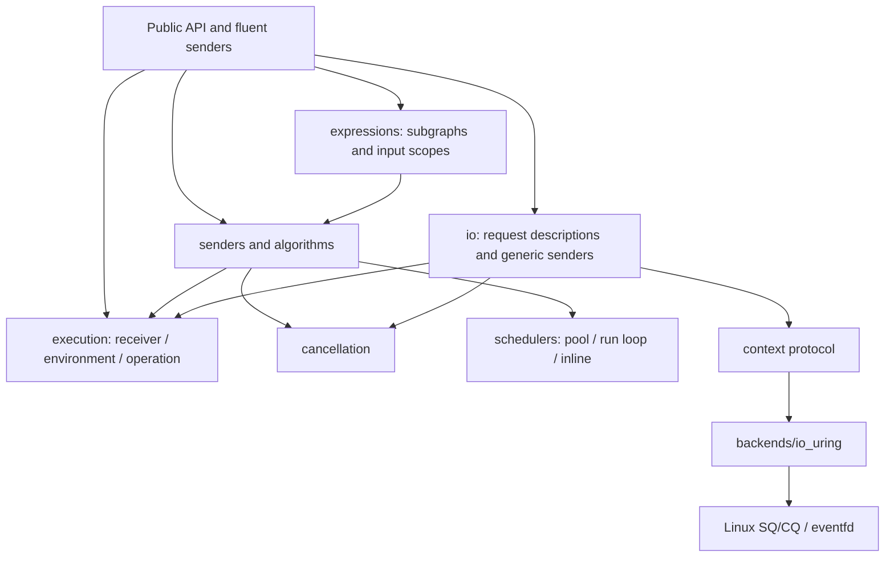

# stdexec Research and Library Architecture

**English** | [简体中文](design.zh-CN.md)

Research and implementation baseline: 2026-09-18, Zig
`0.17.0-dev.2127+e90365cd5`. Version 0.2 expands the original CPU task
composition library with complete stop callbacks, explicit shared state, a
backend-independent I/O protocol, and io_uring.

## Standards basis

Primary references:

- [P2300R10](https://www.open-std.org/jtc1/sc22/wg21/docs/papers/2024/p2300r10.html)
  for sender/receiver motivation, lifetimes, scheduling, and cancellation.
- The [current C++ execution draft](https://eel.is/c++draft/exec) after P2300
  integration.
- [when_all](https://eel.is/c++draft/exec.when.all) and
  [continues_on](https://eel.is/c++draft/exec.continues.on) semantics.
- [NVIDIA/stdexec](https://github.com/NVIDIA/stdexec) and its
  [user guide](https://nvidia.github.io/stdexec/user/).

stdexec, the P2300 proposal, and the current `std::execution` draft do not
expose identical API generations. zigexec follows the model and common
semantics without claiming complete standard conformance. In particular,
`split` uses the explicit Zig ownership and value semantics documented here.

## Layers



Base senders, algorithms, and execution contexts live in separate files.
Shared transform/let templates are under `algorithms/detail/`; queue, task,
and synchronization helpers are under `detail/`. `root.zig` is a public
surface rather than an implementation container. Tests import the public
`zigexec` module, and test synchronization uses an independent futex helper.

`std.Io` may become an adapter backend but is not a prerequisite. The current
implementation uses `std.atomic`, `std.Thread`, `std.mem.Allocator`, and
low-level Linux APIs.

## Execution protocol

A sender provides:

```zig
pub const Values = @Tuple(&.{i64});
pub const Operation = ...;
pub fn connect(self: Self, receiver: Receiver(Values)) Operation;
```

An operation provides `start(self: *Operation) void` and starts once. Exactly
one of value, error, or stopped is sent, and receiver methods return `void`.
User receivers expose an `Env` through `getEnv()`. Both allocator and stop
token are optional; querying a missing allocator returns
`error.MissingAllocator`.

Zig has no C++ guaranteed copy elision. `connect` returns a value without
self-references and `start` connects children in their final storage.
Operations cannot move after start. Public `ex.connect` returns
`Connection(S)`, whose execution scope separates logical completion from safe
storage retirement: `setValue` accepts `*const Values`, and a root receiver
retires the connection only in `setFinished`. See
[operation lifetimes](lifetimes.md).

`connect` is infallible as a protocol. Explicit constructors may return
allocation errors, or startup may report failures through the error channel.
An unstarted ordinary operation owns no resource requiring destruction; a
shared view retains state only when started.

## Zig API choices

Fluent methods and free functions use the same underlying algorithms.
`asSender(custom)` adds a facade containing only the implementation.

| stdexec style | Zig |
| --- | --- |
| `just(a,b)` | `just(.{a,b})` |
| `then(s,f)` | `s.then(Callback, args)` |
| `let_value/error/stopped` | `s.letValue/letError/letStopped(Factory, args)` |
| `upon_error/stopped` | `s.uponError/uponStopped(Callback, args)` |
| `when_all(a,b)` | `whenAll(.{a,b})` |
| `starts_on(sch,s)` | `startsOn(sch,s)` / `s.startsOn(sch)` |
| `continues_on(s,sch)` | `s.continuesOn(sch)` |
| `sync_wait(s)` | `s.syncWait(env)` |
| Shared computation | `try s.split(allocator)` plus an explicit owner |

Callbacks are compile-time struct types whose fields are initialized explicitly
from positional or named arguments. `self` may be a value or a pointer into
operation storage. `Fn(function)` adapts ordinary functions. Mutable shared
state uses explicit pointers; there are no implicit captures.

`letValue(body, .{})` introduces an input scope. The body is a deferred
expression with runtime captures, and `upstream()` borrows stable completion
storage from the nearest scope. Dynamic buffers are explicitly allocated and
passed as slices. Each callback factory returns one sender while the complete
subgraph is composed and inferred. See [expressions](expressions.md).

Every sender has one static success tuple, with `anyerror` and stopped as
separate channels. `syncWait` returns `anyerror!?Values`. Callback
`void`/`!void` becomes empty success, while `T`/`!T` becomes a
one-element tuple. Recovery preserves the original success tuple; heterogeneous
application outcomes can use a tagged union value.

Receivers preserve a static `Values` type while erasing a context and three
function pointers to avoid recursive generic receiver types. There is no claim
that all indirect calls disappear or performance equals C++ stdexec.

## Type construction and contextual inference

Public `Just`, `Then`, `LetValue`, `WhenAll`, `StartsOn`, and related
constructors correspond to runtime functions and produce exact concrete types
with fluent methods. Type-level composition such as
`Just(.{i64}).Then(F).StartsOn(Scheduler)` is supported. `asSender` is
idempotent.

I/O types such as `io.ReadSome(Context)` depend only on context pointer type
and operation kind, not runtime descriptors or buffers. `io.For(Context)`
binds the context once and exposes matching types and lowercase constructors.

Callback inference uses actual upstream tuples: `S.Values` for value, one
`anyerror` for error, no argument for stopped, and a leading `usize` for
bulk. Generic `call(self, value: anytype)` can therefore return a type based on
its input; `callTuple` supports arbitrary arity. Reflection checks methods,
`self`, arity, input types, and factory sender protocols during composition.

`Fn` encodes function identity in a callback type. Callback fields are
preferred for captures; low-level `Bind` can bind prefix arguments.
`meta.ReturnOf` queries a known function's return type without executing it.
This is not arbitrary function-body return inference; Zig boundaries still
require declarations. See the [type API](types.md).

## Allocators, composition, and scheduling

The optional allocator belongs to `Env`; there is no implicit global
allocator. A sender queries it during `start` and reports a missing allocator
or allocation failure through the error channel. `whenAll` and
`withStopToken` override only cancellation state. Static operations remain
embedded.

A shared upstream has an internal receiver using its owner's allocator.
`syncWait` does not destroy an implicit arena, and an allocator does not own
user values. See [allocator semantics](allocators.md).

`whenAll` stores branch results separately and publishes them with
acquire/release atomics. A startup reference prevents a synchronous branch from
destroying parent state early. CAS records the first observed error; error wins
over stopped, and every branch is awaited. `whenAll(.{})` is an extra empty
success identity even though the current C++ draft forbids zero arguments.

Stop forwarding can synchronously complete a subgraph, so forwarding callbacks
retain a temporary reference and unregister parent-token forwarding before
final notification. See [cancellation](cancellation.md).

`startsOn` schedules before starting upstream and controls only the start
location. `continuesOn` retains a completion, schedules, then forwards it;
scheduler error or stopped replaces the retained result.

`ThreadPool` allocates its context and thread array once, while queue nodes
live in operations. `RunLoop.finish` drains existing submissions and rejects
new ones. A downstream reschedule during shutdown can therefore fail; normal
shutdown first waits for the root sender.

## Shared state and the I/O context protocol

Shared-owner, started-subscription, and upstream-execution references are
independent. Subscriptions and the cache are registered under a lock, while
start and notification occur outside it. Cancellation temporarily retains
state. Ordinary copying does not increment references; owners use `clone()`
and views remain borrowed. See [shared senders](shared.md).

`io/request.zig` defines backend-independent POSIX descriptions and completion
results. `io/sender.zig` implements connection, token registration, and typed
completion. A context supplies:

- An associated `Request` with `description`, `context`, and `complete`
  fields; backend fields may have defaults.
- `submit(self, request)`: thread-safe, nonblocking with respect to result,
  exactly-once completion, possibly synchronous.
- `cancel(self, request)`: thread-safe and permitted before submit, but only a
  request for cancellation. It must not complete before submit because the
  sender is still installing its stop registration.
- Completion only after the external system no longer borrows the request or
  user memory, with no node access after completion.

io_uring embeds backend state in `Request`; separate submission and completion
modules encode SQEs and decode CQEs. Storage can be released only after both the
target and cancellation CQEs arrive. See the [io_uring backend](io_uring.md).

## Current boundaries

`letValue` retains upstream operations and factory state while borrowing
inputs. The root connection remains until execution entries exit. External
pointers, slices, and handles are borrowed by default; scopes do not extend
factory locals or external resources. Zig values have no implicit destructor,
so algorithms never call `deinit` for discarded application values.

Environment-restoring `on`, `whenAny`, general timeout composition,
`async_scope`, custom shared-result destruction, coroutine/GPU integration,
and other platform backends are not yet implemented. The existing cancellation
registration and I/O protocols are intended to support those additions without
replacing the core lifetime model.
