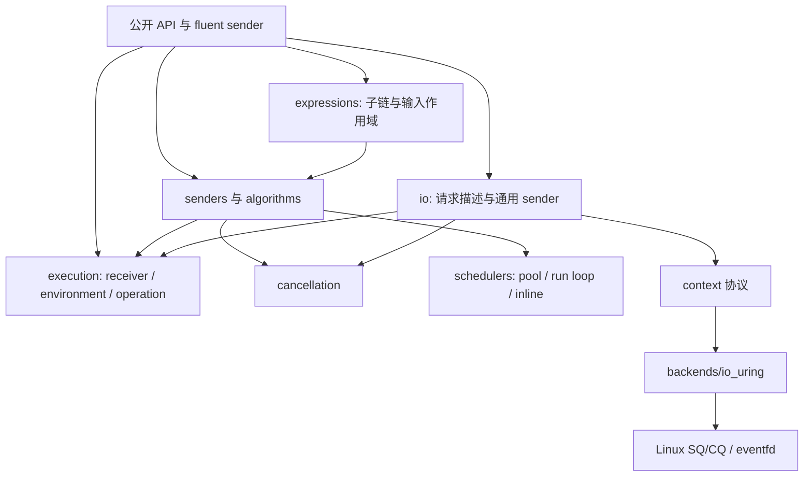

# stdexec 研究与库架构

[English](design.md) | **简体中文**

研究与实现基线：2026-09-18，Zig `0.17.0-dev.2127+e90365cd5`。当前版本为 0.2：从最初的 CPU 任务组合扩展到完整 stop callback、显式共享状态、后端无关 I/O 协议与 io_uring。

## 标准依据

一手资料：

- [P2300R10](https://www.open-std.org/jtc1/sc22/wg21/docs/papers/2024/p2300r10.html)：sender/receiver、生命周期、调度和取消的设计动机。
- [当前 C++ 执行库草案](https://eel.is/c++draft/exec)：P2300 合入后的演进。
- [when_all](https://eel.is/c++draft/exec.when.all)：等待所有输入、拼接值、错误优先与兄弟取消。
- [continues_on](https://eel.is/c++draft/exec.continues.on)：保存完成后重新调度；调度失败/停止可以替换保存的结果。
- [NVIDIA/stdexec](https://github.com/NVIDIA/stdexec) 与 [用户指南](https://nvidia.github.io/stdexec/user/)：标准模型参考实现与扩展算法。

stdexec 实现、P2300 提案与当前 `std::execution` 不是同一个版本的接口集合。本库追求模型和常用语义，不宣称完整标准兼容；`split` 采用本文明确列出的 Zig 所有权/值语义。

## 分层



基础 sender、算法、执行上下文各自独立文件。共用的 transform/let 模板在 `algorithms/detail/`，queue/task/sync 在 `detail/`。`root.zig` 只提供公共入口，不收纳算法实现。`tests/` 是独立测试模块，从公开 `zigexec` import 访问库；测试辅助同步独立于库的 futex 实现。

`std.Io` 可以是未来的适配后端，不是依赖前提。当前库使用 `std.atomic`、`std.Thread`、`std.mem.Allocator` 和低层 Linux API。

## 执行协议

Sender 提供：

```zig
pub const Values = @Tuple(&.{i64});
pub fn Operation(comptime R: type) type { ... }
pub fn connectInto(self: Self, out: anytype, receiver: anytype) void;
```

Operation 提供 `start(self: *Operation) void`，只能调用一次。成功、错误、停止恰好选择一个通道；receiver 的方法返回 `void`。用户 receiver 必须通过 `getEnv()` 暴露 Env；Env 的 allocator 和 stop token 均可省略；缺失 allocator 仅在查询时返回 error.MissingAllocator。

`connectInto(&op, sender, receiver)` 在最终地址构造 `ex.Connection(S, R)`，
并连接已知子 operation；`start` 启动它们。从 connectInto 起禁止移动/复制，
不依赖 C++ guaranteed copy elision。工厂依赖输入的后续分支在输入到达后连接；
repeat 可在上一轮 completion 中重连。普通节点保存自身状态和子 operation，不再保留上游
sender 描述；repeat 为重建保留描述是必要例外。

setValue 接收 *const Values；receiver 可在任意 completion 中回收 operation，
生产者通知后不再访问它；拥有者仍可保留 child 来借用结果。详见 [生命周期协议](lifetimes.zh-CN.md)。这与 P2300
在构造阶段连接已知子节点、允许具体 receiver 引用父状态的做法一致，研究见
[P2300 operation 构造研究](p2300-operation-state.zh-CN.md)。

`connectInto` 是不可失败的协议。需要资源分配时在显式构造函数返回错误，或在启动后通过 error 通道报告。未启动的普通 operation 不持有需要析构的资源；Shared view 在 `start` 才取得状态引用。

## Zig API 取舍

链式方法和自由函数共用底层算法。`asSender(custom)` 为自定义 sender 添加 fluent facade；facade 只包含原 sender，没有额外动态节点。

| stdexec 风格 | Zig |
| --- | --- |
| `just(a,b)` | `just(.{a,b})` |
| `then(s,f)` | `s.then(Callback, args)` |
| `let_value/error/stopped` | `s.letValue/letError/letStopped(Factory, args)` |
| `upon_error/stopped` | `s.uponError/uponStopped(Callback, args)` |
| `when_all(a,b)` | `whenAll(.{a,b})` |
| `starts_on(sch,s)` | `startsOn(sch,s)` / `s.startsOn(sch)` |
| `continues_on(s,sch)` | `s.continuesOn(sch)` |
| `sync_wait(s)` | `s.syncWait(env)` |
| 共享计算 | `try s.split(allocator)` 与显式 owner |

回调参数是编译期 struct 类型，状态通过 tuple 或命名字段显式初始化；call 的 self 可为值或指向 operation 内存储的指针。普通函数用 `Fn(function)` 适配。没有隐式捕获；共享可变状态显式传指针。

`letValue(body, .{})` 引入输入作用域，body 是带运行时捕获的 deferred 表达式。`upstream()` 绑定最近一层 scope 的完成值并借用其稳定存储；需要稳定的动态 buffer 时，显式分配并传递 slice。callback 工厂仅返回一个 sender，整条子链直接组合并推导。详见 [表达式与生命周期](expressions.zh-CN.md)。

每个 sender 有一个静态成功 tuple，错误统一为 `anyerror`，stopped 独立。`syncWait` 返回 `anyerror!?Values`。回调 `void/!void` 成功产生空 tuple，`T/!T` 成功产生单元素 tuple。恢复分支必须保持成功 tuple 类型，异形结果可作为 tagged union 值传递。

每个 sender 的 `Operation(R)` 都保留 receiver 具体类型；`TypedReceiver(Values, R)` 只存储 R，完成调用静态分派，`OperationOf` 就是 `S.Operation(R)` 的别名，没有擦除回退路径。内核请求、取消回调、异构等待队列的通知入口仍使用函数指针，因此这是 sender 层的静态分派，不宣称整套运行时完全没有间接调用。

## 类型构造器与上下文推导

公开的 `Just/Then/LetValue/WhenAll/StartsOn/...` 与运行时构造器成对，返回包含 fluent 方法的准确具体类型。类型级方法允许 `Just(.{i64}).Then(F).StartsOn(Scheduler)` 的组合。`asSender` 幂等，scheduler 的成员和自由函数形式不会多包装一次而产生不同类型。

`io.ReadSome(Context)` 等 I/O 类型只依赖 context 指针类型和操作种类，不依赖 fd/buffer 的运行时值。`io.For(Context)` 固定一次 context 类型，提供 `Io.ReadSome` 等类型及同名小写函数。

回调推导改为使用实际上游参数 tuple：value 使用 `S.Values`，error 使用单个 `anyerror`，stopped 使用空 tuple，bulk 前置 `usize` 索引。泛型 struct `call(self, value: anytype)` 因而可以产生依赖输入类型的返回值；`callTuple(self, args)` 支持任意数量参数。公开算法通过反射检查 call/self、参数数量、输入类型及工厂返回协议；类型相关的错误在组合时报告。

`Fn(function)` 把函数身份编码进 callback 类型；需要捕获时优先用 callback 字段。低层 `Bind/bind` 仍可绑定函数前置参数。`meta.ReturnOf` 查询已知函数的返回类型，不执行函数体。

这不等于任意函数体的自动返回类型推导；Zig 的函数边界仍需声明。完整用法与边界见 [类型 API](types.zh-CN.md)。

## 执行 allocator

allocator 属于 Env。syncWait(sender, env) 显式接收环境，其内部 receiver 通过 getEnv 暴露该环境；不提供默认全局 allocator。sender 在 start 中通过 receiver.getEnv().getAllocator() 获取并处理错误；缺失 allocator 或动态分配失败通过 error 通道报告。whenAll 与 withStopToken 仅覆盖取消 token，保留其余环境字段。静态操作继续直接嵌入 operation。

共享上游有独立的内部 receiver，使用 shared owner 的 allocator。allocator 本身不管理值的所有权，syncWait 也不销毁隐式 arena；拥有型结果可以留给调用方消费与释放。与 stdexec 的对照和本库的显式环境规则见 [allocator 与环境设计](allocators.zh-CN.md)。

## 组合与生命周期

`whenAll` 每个子任务独立存储完成结果，通过 acquire/release 原子计数发布。启动阶段持有额外引用，避免同步分支过早完成并释放父状态。错误通过 CAS 记录最先观察到的错误；最终 error 优先于 stopped；总是等待所有分支。

停止转发可能同步完成子图，因此转发回调也持有临时引用，完成路径先解除父 token 注册。详见 [取消协议](cancellation.zh-CN.md)。

`whenAll(.{})` 是本库额外提供的空成功恒等元；当前 C++ 草案禁止零参数 `when_all`，此处不宣称标准一致。

`startsOn` 相当于 schedule 后 letValue 启动上游，只保证启动位置；内部异步 sender 仍可改变完成线程。`continuesOn` 暂存三个完成通道，再调度并转发；调度本身的 error/stopped 优先。

`ThreadPool` 一次性分配 context、线程数组与各 worker 队列，任务节点存在 operation 内。每个 worker 拥有有界 FIFO 环：worker 内的提交无锁进入自己的环，空闲 worker 窃取其他 worker 的一半任务，其他线程的提交（或环满时）进入一个加锁的注入队列。只有没有 worker 正在搜索时，提交才唤醒休眠的 worker。`close()` 拒绝新提交；`deinit()` 在 join 前执行完所有已接受的任务。`RunLoop.finish` 排空已有提交并拒绝新提交；关闭时后续阶段若再调度可能失败，因此正常路径应先等根 sender 完成。

## 共享状态

Shared owner 的引用、启动后的订阅引用、上游执行引用相互独立。锁内登记订阅/缓存结果，锁外启动与通知；一次上游可以服务并发及迟到的订阅。取消请求保留临时引用，防止 source 在 dispatch 中被释放。

普通 Zig 复制不增加引用计数，owner 必须用 `clone()`；view 是借用值。缓存采用值复制，资源没有隐式深拷贝或析构。详见 [共享状态](shared.zh-CN.md)。

## I/O context 协议

`io/request.zig` 定义后端无关的 POSIX 请求描述与 value/error/stopped 结果，`io/sender.zig` 处理连接、token 注册、类型化完成。每种 I/O 操作的公开构造器独立位于 `io/operations/`。

Context 类型需要：

- 关联 `Request` 类型，含 `description`、`context`、`complete` 字段，其他字段可具有后端自己的默认值。
- `submit(self, request)`：线程安全，不阻塞等待结果，恰好完成一次；可同步完成。
- `cancel(self, request)`：线程安全，允许在 submit 前发生，只请求取消。**submit 前不能调用完成**，因为 sender 此时尚在安装取消注册。
- 完成函数只能在内核/外部系统不再借用 request 和用户内存后调用。完成后不能再解引用节点。

io_uring 将后端状态嵌入 Request，单独的 submission/completion 模块编码 SQE 与解码 CQE，context 负责队列、唤醒、取消以及关闭。目标 CQE 与取消 CQE 都收齐后才允许释放节点。详见 [io_uring 后端](io_uring.zh-CN.md)。

## 当前边界

`letValue` 保留上游 operation 和工厂状态，借用其输入；拥有者可在完成后继续保留 child 来延长借用；已有 sender 形式按顺序启动子任务，deferred 形式绑定最近一层输入。所有外部指针/slice/句柄默认借用；scope 不延长工厂栈局部变量或外部资源的生命周期，内部借用不得越过所属 operation 的销毁。资源清理由调用方显式安排。析构不是 Zig 值的隐式行为，组合算法不会自动对丢弃的用户值调用 `deinit`。

尚未提供环境作用域恢复的 `on`、尚未实现的 async-scope 适配器 `spawnFuture`、共享状态自定义值析构策略、协程/GPU 或其他平台后端。下一步可以基于已有取消注册与 I/O 协议实现这些能力，而不必改写核心生命周期模型。

`SimpleCountingScope` 与 `CountingScope` 对齐关联计数模型，`spawn` 负责分配和 operation
所有权，`runInScope` 单独提供生产任务的失败/收尾策略。Env.start_scheduler 决定异步 join
完成的调度位置，syncWait 默认提供等待线程上的 RunLoop。详见 [计数作用域](counting_scopes.zh-CN.md)。

`whenAll` 向下游传拼接后的多个完成参数；`whenAny` 传 tagged union，且等待输掉的分支退出后再通知下游。详见 [并发结果](combinators.zh-CN.md)。
